---
## Front matter
lang: ru-RU
title: "Лабораторная работа №1"
subtitle: Операционные системы
author:
  - Бызова Мария Олеговна, НПИбд-01-23.
institute:
  - Российский университет дружбы народов, Москва, Россия
date: 20 февраля 2024

## i18n babel
babel-lang: russian
babel-otherlangs: english

## Formatting pdf
toc: false
toc-title: Содержание
slide_level: 2
aspectratio: 169
section-titles: true
theme: metropolis
header-includes:
 - \metroset{progressbar=frametitle,sectionpage=progressbar,numbering=fraction}
 - '\makeatletter'
 - '\beamer@ignorenonframefalse'
 - '\makeatother'

## Fonts 
mainfont: PT Serif 
romanfont: PT Serif 
sansfont: PT Sans 
monofont: PT Mono 
mainfontoptions: Ligatures=TeX 
romanfontoptions: Ligatures=TeX 
sansfontoptions: Ligatures=TeX,Scale=MatchLowercase 
monofontoptions: Scale=MatchLowercase,Scale=0.9

---

## Цель работы

Целью данной работы является приобретение практических навыков установки операционной системы на виртуальную машину, настройки минимально необходимых для дальнейшей работы сервисов.

## Задание

1. Создание виртуальной машины.
2. Установка операционной системы.
3. Работа с операционной системой после установки.
4. Установка программного обеспечения для создания документации.
5. Дополнительные задания.

## Создание виртуальной машины

Cоздаю новую виртуальную машину, указываю ее имя, путь к папке машины по умолчанию меня устраивает, выбираю тип ОС и версию. Выбираю скачанный образ операционной системы. (рис. 1)

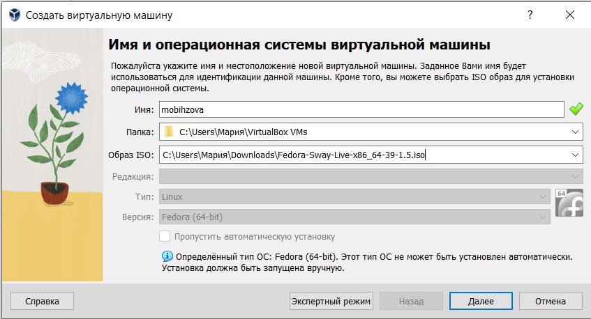{#fig:001 width=70%}

## Создание виртуальной машины

Указываю объем основной памяти виртуальной машины размером 4096М (рис. 2)

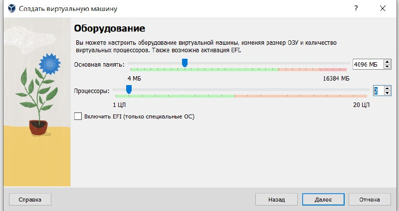{#fig:002 width=70%}

## Создание виртуальной машины

Выбираю создание нового виртуального диска, задав конфигурацию жесткого диска: загрузочный VDI. Задаю размер диска - 80 ГБ, оставляю расположение жесткого диска по умолчанию, т.к. работаю на собственной технике и значение по умолчанию меня устраивает. (рис. 3)

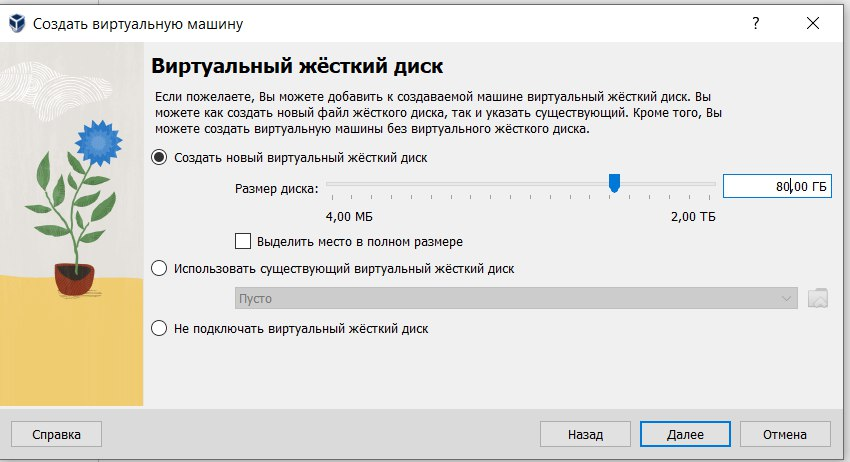{#fig:003 width=70%}

## Создание виртуальной машины

В качестве графического контроллера ставлю VMSVGA и включаю ускорение 3D (рис. 4)

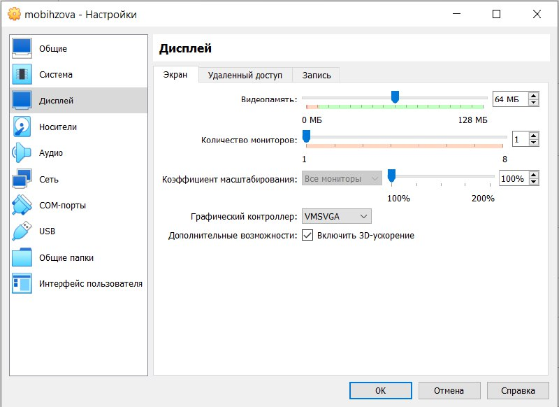{#fig:004 width=70%}

## Создание виртуальной машины

Включаю общий буфер обмена и перетаскивание объектов между хостом и гостевой ОС. (рис. 5)

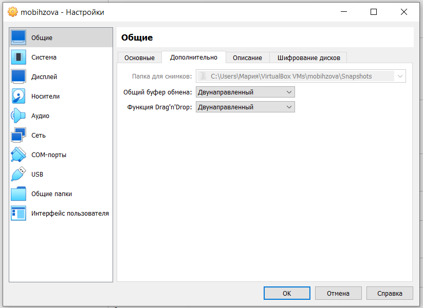{#fig:005 width=70%}

## Создание виртуальной машины

Включаю поддержку UEFI. (рис. 6)

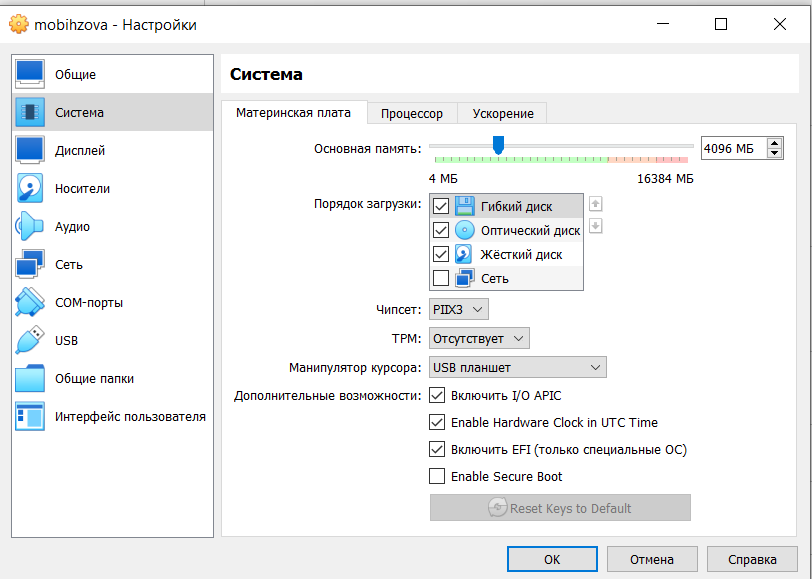{#fig:006 width=70%}

## Установка операционной системы

Загружаю LiveCD. Появляется интерфейс начальной конфигурации. (рис. 7)

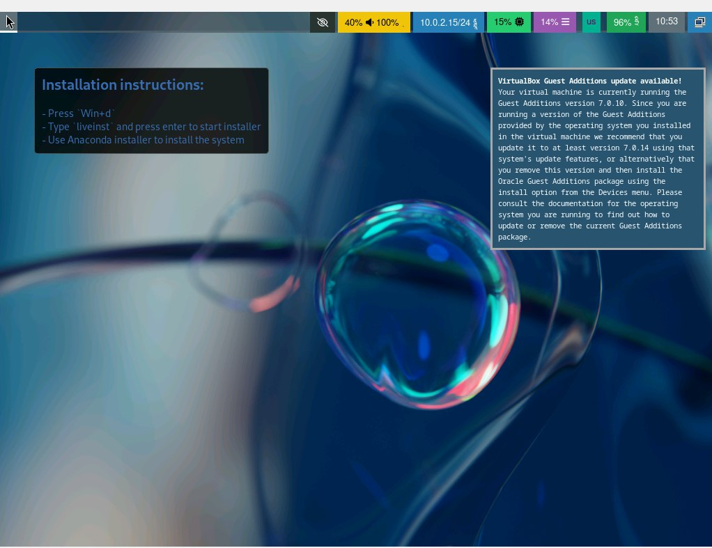{#fig:007 width=70%}

## Установка операционной системы

Нажимаю комбинацию Win+Enter для запуска терминала. В терминале запускаю liveinst. Для перехода к раскладке окон с табами нажимаю Win+w.(рис. 8)

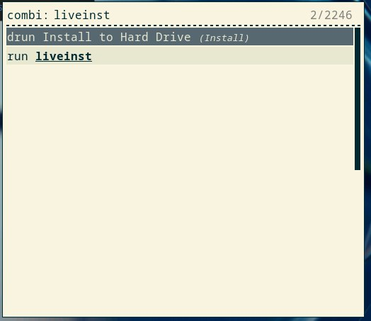{#fig:008 width=70%}

## Установка операционной системы

Выбираю язык интерфейса и перехожу к настройкам установки операционной системы. Я не корректирую часовой пояс, раскладку клавиатуры и место установки ОС, так как в этом нет необходимости (рис. 9)

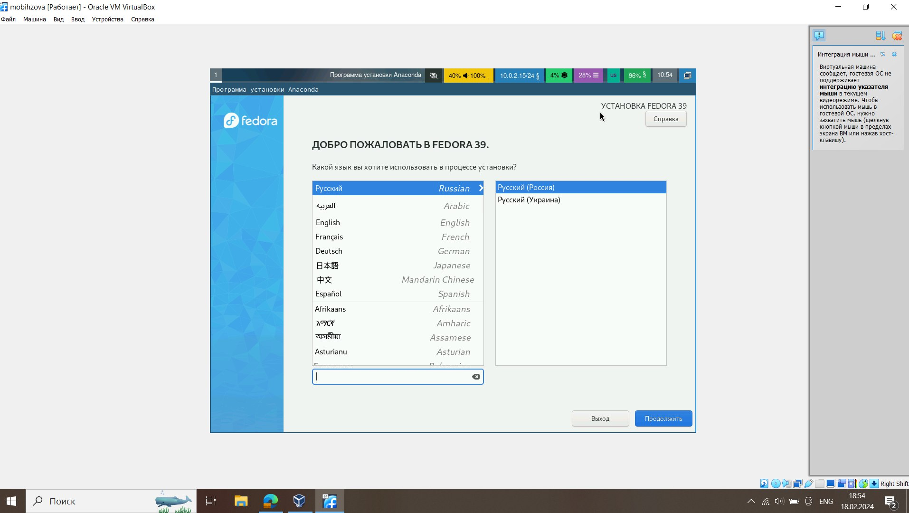{#fig:009 width=70%}

## Установка операционной системы

Установливаю имя и пароль для пользователя root. (рис. 10)

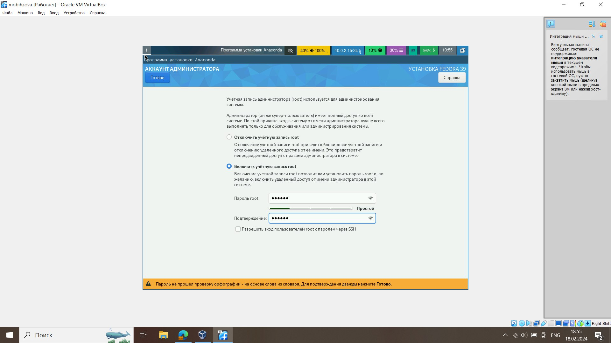{#fig:010 width=70%

## Установка операционной системы}

Установливаю имя и пароль для моего пользователя.(рис. 10)

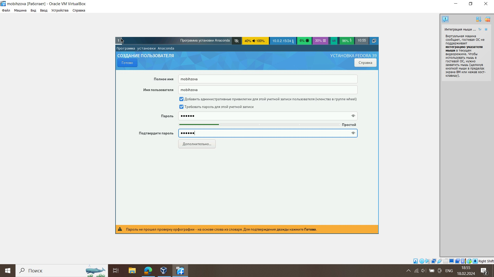{#fig:011 width=70%}

## Установка операционной системы

Далее операционная система устанавливается. После установки нажимаю "Завершить установку" (рис. 11)

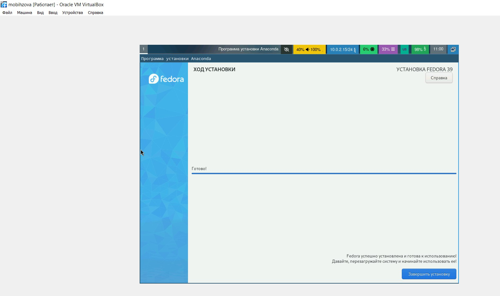{#fig:012 width=70%}

## Установка операционной системы

Диск не отключался автоматически, поэтому отключаю носитель информации с образом (рис. 12)

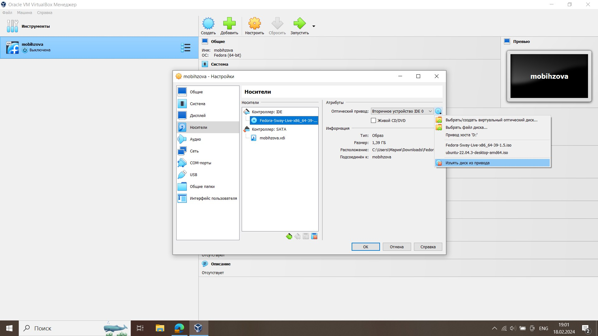{#fig:013 width=70%}

## Работа с операционной системой после установки

Запускаю виртуальную машину. Вхожу в ОС под заданной мной при установке учетной записью  (рис. 13)

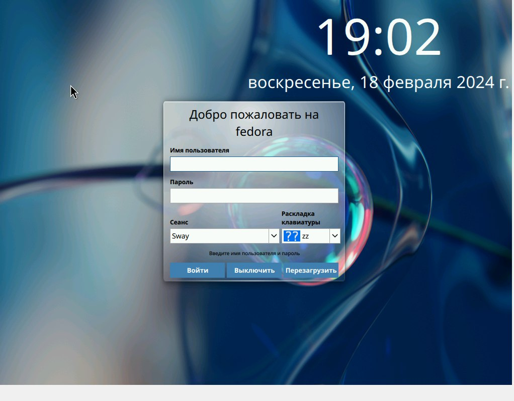{#fig:014 width=70%}

## Работа с операционной системой после установки

Нажимаю WIN+ENTER для запуска терминала и переключаюсь на роль суперпользователя. Обновляю все пакеты  (рис. 14)

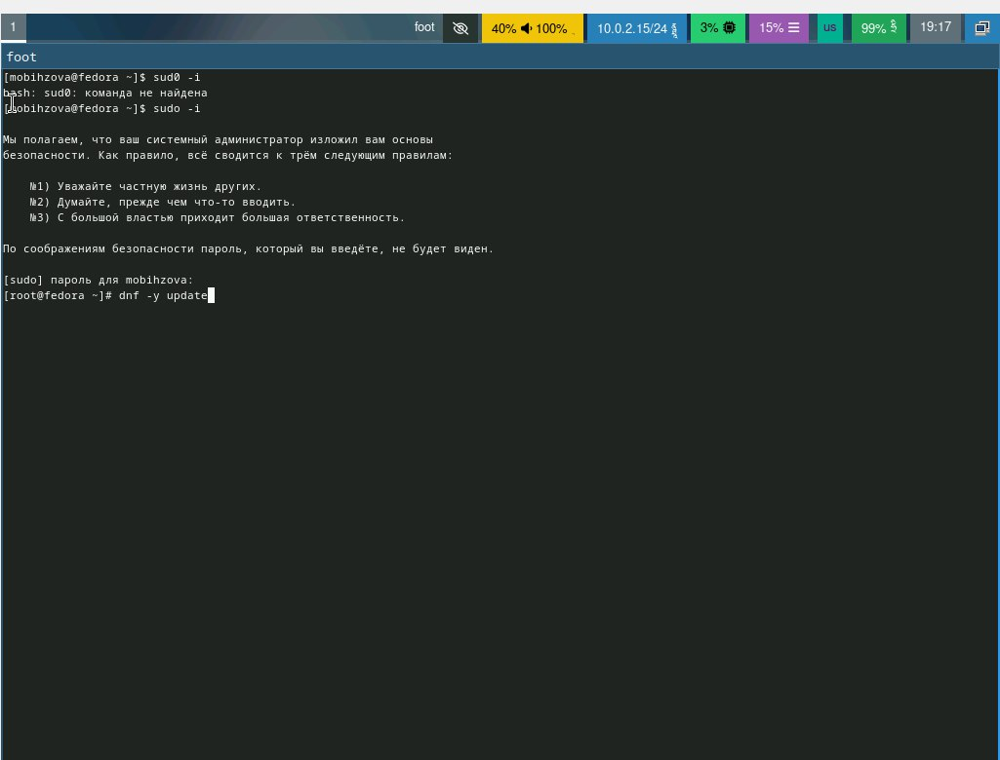{#fig:015 width=70%}

## Работа с операционной системой после установки

Устанавливаю программы для удобства работы в консоли: tmux для открытия нескольких "вкладок" в одном терминале, mc в качестве файлового менеджера в терминале  (рис. 15)

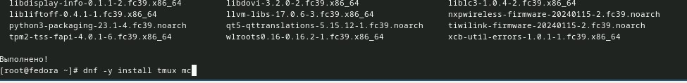{#fig:016 width=70%}

## Работа с операционной системой после установки

Устанавливаю программы для автоматического обновления (рис. 16)

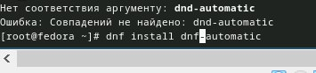{#fig:017 width=70%}

## Работа с операционной системой после установки

Запускаю таймер  (рис. 17)

{#fig:018 width=70%}

## Работа с операционной системой после установки

Переместившись в директорию /etc/selinux, открываю mc, ищу нужный файл. Изменяю открытый файл: SELINUX=enforcing заменяю SELINUX=permissive, после чего перезагружаю виртуальную машину  (рис. 18)

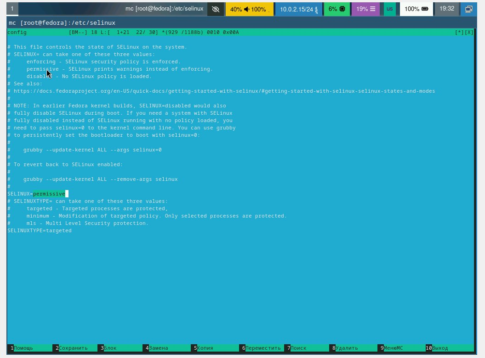{#fig:019 width=70%}

## Работа с операционной системой после установки

Снова вхожу в ОС, снова запускаю терминальный мультиплексор, переключаюсь на роль суперпользователя и устанавливаю средства разработки  (рис. 19)

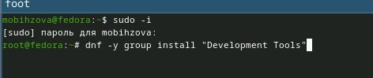{#fig:020 width=70%}

## Работа с операционной системой после установки

Устанавливаю пакет dkms (рис. 20)

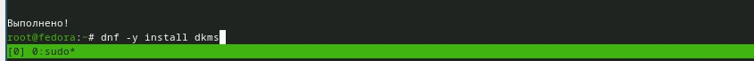{#fig:021 width=70%}

## Работа с операционной системой после установки

В меню виртуальной машины подключаю образ диска гостевой ОС  (рис. 21)

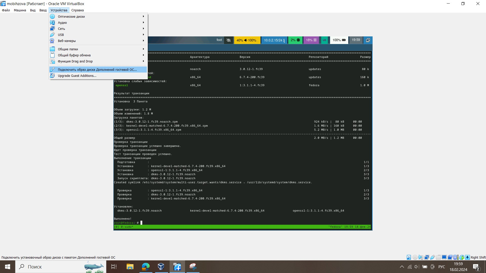{#fig:022 width=70%}

## Работа с операционной системой после установки

Примонтирую диск и установлю драйвера, после чего перезагружу виртуальную машину  (рис. 22)

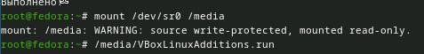{#fig:023 width=70%}

## Работа с операционной системой после установки

Вхожу в ОС под заданной мной при установке учётной записью, запускаю терминальный мультиплексор tmux, создаю конфигурационный файл ~/.config/sway/config.d/95-system-keyboard-config.conf  (рис. 23)

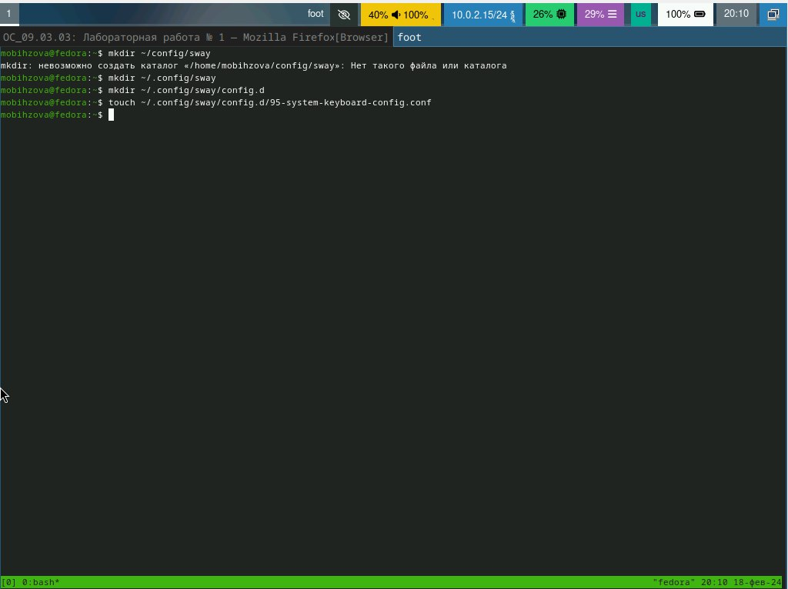{#fig:024 width=70%}

## Работа с операционной системой после установки

Отредактирую конфигурационный файл ~/.config/sway/config.d/95-system-keyboard-config.conf (рис. 24)

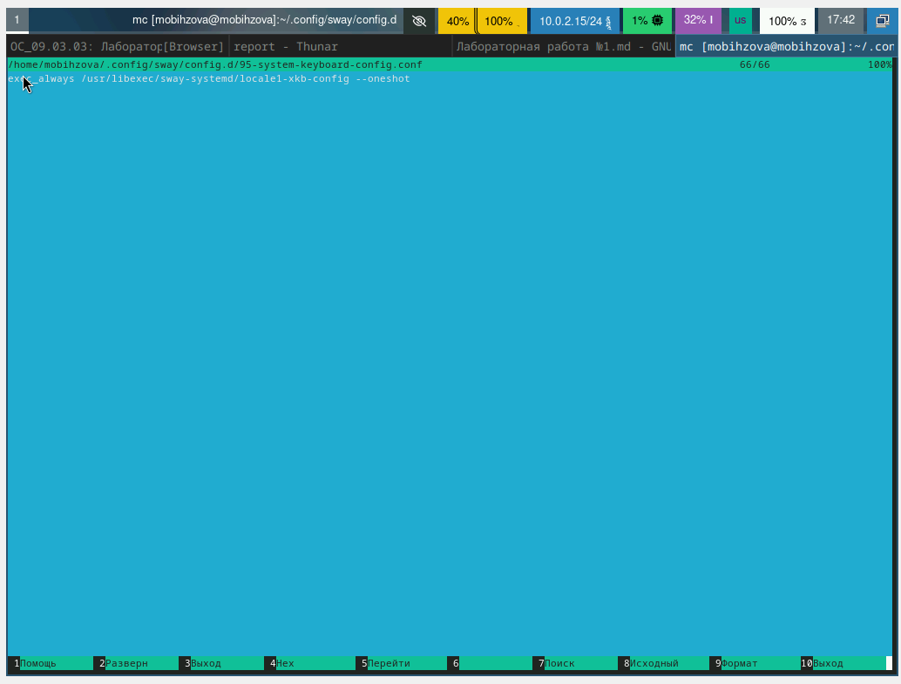{#fig:025 width=70%}

## Работа с операционной системой после установки

Переключаюсь на роль супер-пользователя sudo, отредактирую конфигурационный файл /etc/X11/xorg.conf.d/00-keyboard.conf, после чего перезагружу виртуальную машину (рис. 25)

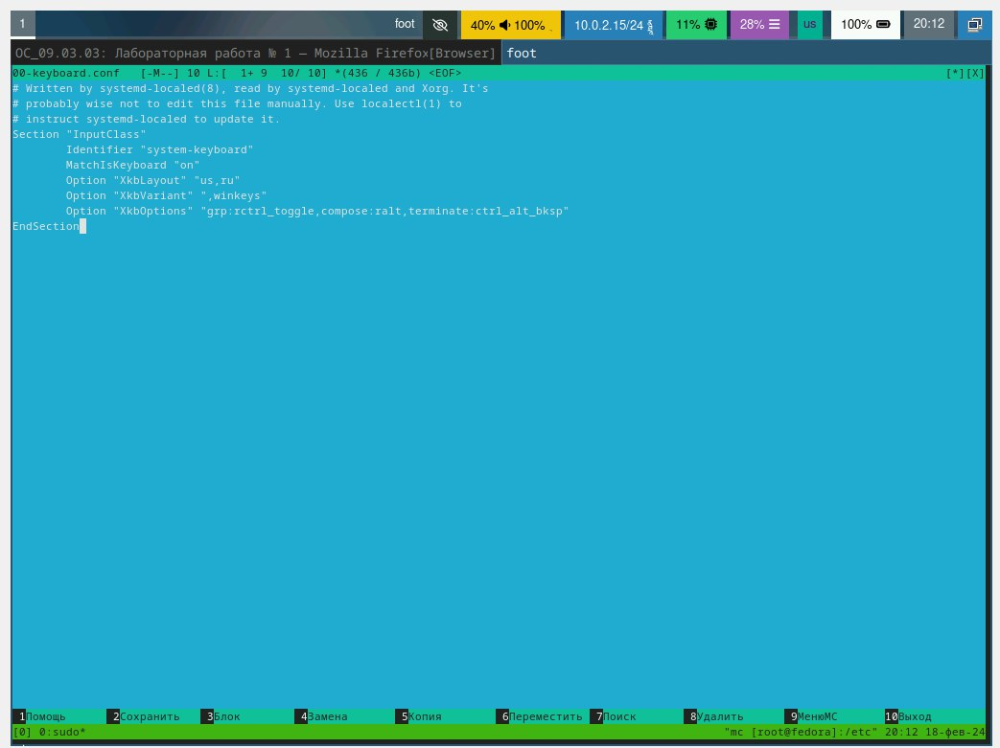{#fig:026 width=70%}

## Работа с операционной системой после установки

Вхожу в ОС под заданной мной при установке учётной записью, запускаю терминальный мультиплексор tmux. Переключаюсь на роль суперпользователя. Создаю пользователя  (рис. 26)

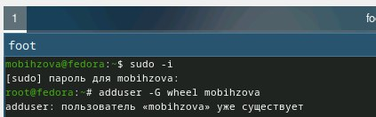{#fig:027 width=70%}

## Работа с операционной системой после установки

Задаю пароль для пользователя  (рис. 27)

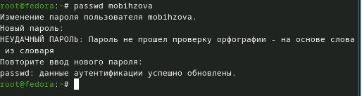{#fig:028 width=70%}

## Работа с операционной системой после установки

Установлю имя хоста, Проверю, что имя хоста установлено верно (рис. 28)

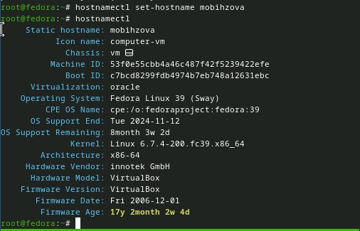{#fig:029 width=70%}

## Работа с операционной системой после установки

Внутри виртуальной машины добавлю своего пользователя в группу vboxsf (рис. 29)

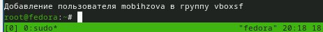{#fig:030 width=70%}

## Работа с операционной системой после установки

В хостовой системе подключаю разделяемую общую папку, после чего перезагружаю систему (рис. 30)

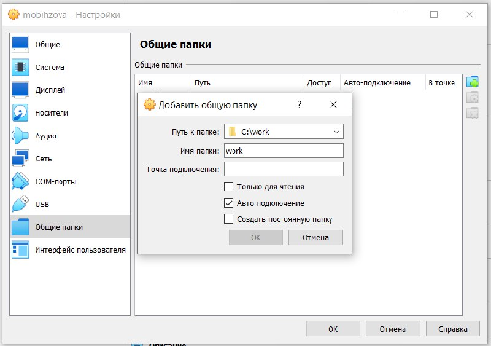{#fig:031 width=70%}

## Работа с операционной системой после установки

Теперь папка будет монтироваться в /media/sf_work (рис. 31)

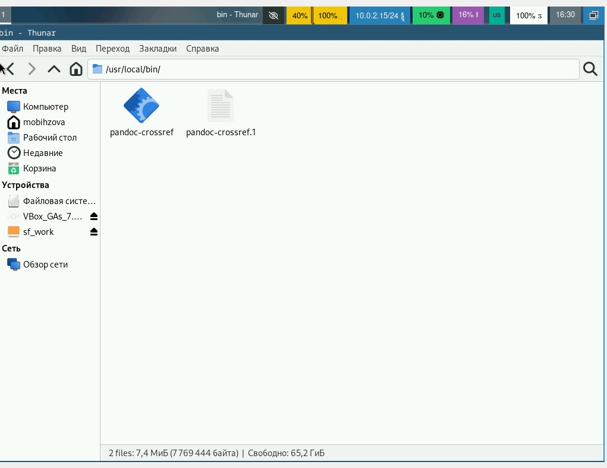{#fig:032 width=70%}

## Установка программного обеспечения для создания документации

Нажмаю комбинацию Win+Enter для запуска терминала, запускаю терминальный мультиплексор tmux, переключаюсь на роль супер-пользователя. Установливаю средство pandoc для работы с языком разметки Markdown с помощью менеджера пакетов (рис. 32)

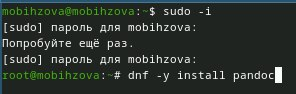{#fig:033 width=70%}

## Установка программного обеспечения для создания документации

Скачав необходимую версию pandoc-crossref, распаковываю архив и помещаю все необходимые файлы в каталог /usr/local/bin (рис. 33, рис. 34)

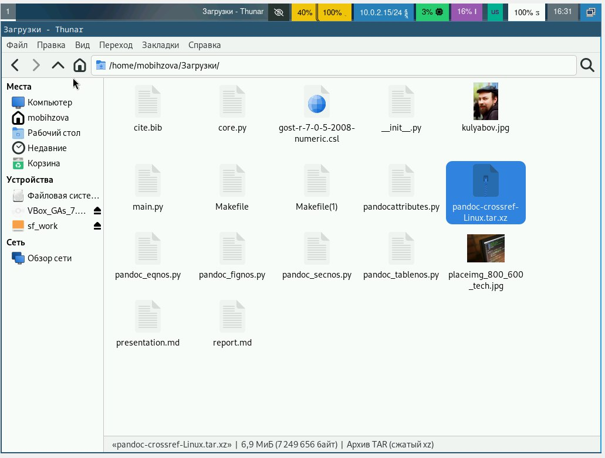{#fig:034 width=70%}

## Установка программного обеспечения для создания документации

{#fig:035 width=70%}

## Установка программного обеспечения для создания документации

Установливаю дистрибутив TeXlive (рис. 35)

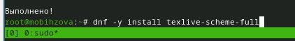{#fig:036 width=70%}

## Выводы

В ходе данной лабораторной работы я приобрела практические навыки установки операционной системы на виртуальную машину, настройки минимально необходимых для дальнейшей работы сервисов.

## Домашнее задание

Дождусь загрузки графического окружения и открою терминал. В окне терминала проанализирую последовательность загрузки системы, выполнив команду dmesg (рис. 36)

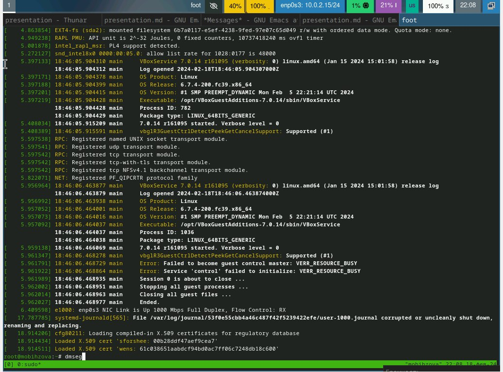{#fig:037 width=70%}

## Домашнее задание

 Можно просто просмотреть вывод команды при помощи dmesg | less (рис. 37)

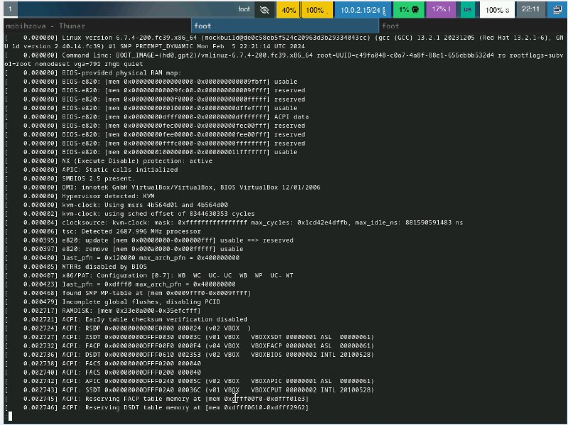{#fig:038 width=70%}

## Домашнее задание

Получите следующую информацию:

а) Версия ядра Linux (Linux version) (рис. 38)

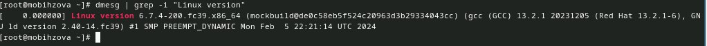{#fig:039 width=70%}

## Домашнее задание

б) Частота процессора (Detected Mhz processor) (рис. 39)

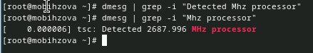{#fig:040 width=70%}

## Домашнее задание

в) Модель процессора (CPU0) (рис. 40)

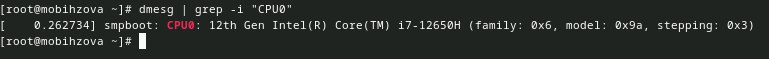{#fig:041 width=70%}

## Домашнее задание

г) Объём доступной оперативной памяти (Memory available) (рис. 41)

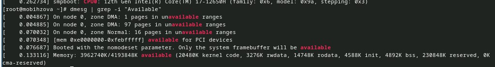{#fig:042 width=70%}

## Домашнее задание

д) Тип обнаруженного гипервизора (Hypervisor detected) (рис. 42)

{#fig:043 width=70%}

## Домашнее задание

е) Тип файловой системы корневого раздела (рис. 43)

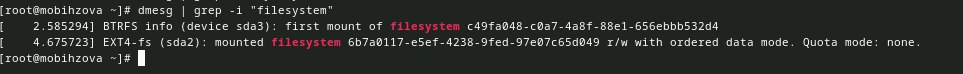{#fig:044 width=70%}

## Домашнее задание

ж) Последовательность монтирования файловых систем (рис. 44)

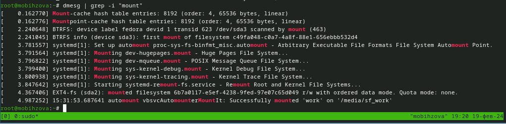{#fig:045 width=70%}

## Список литературы{.unnumbered}

::: {#refs}
1. Dash P. Getting started with oracle vm virtualbox. Packt Publishing Ltd, 2013. 86 p.
2. Colvin H. Virtualbox: An ultimate guide book on virtualization with virtualbox. CreateSpace Independent Publishing Platform, 2015. 70 p.
3. van Vugt S. Red hat rhcsa/rhce 7 cert guide : Red hat enterprise linux 7 (ex200 and ex300). Pearson IT Certification, 2016. 1008 p.
4. Робачевский А., Немнюгин С., Стесик О. Операционная система unix. 2-е изд. Санкт-Петербург: БХВ-Петербург, 2010. 656 p.
5. Немет Э. et al. Unix и Linux: руководство системного администратора. 4-е изд. Вильямс, 2014. 1312 p.
6. Колисниченко Д.Н. Самоучитель системного администратора Linux. СПб.: БХВ-Петербург, 2011. 544 p.
7. Robbins A. Bash pocket reference. O’Reilly Media, 2016. 156 p.

:::

