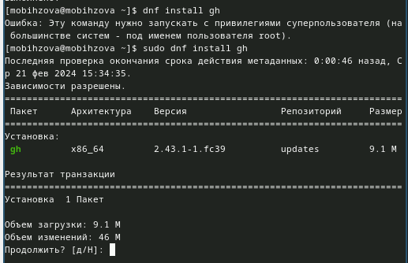

---
## Front matter
lang: ru-RU
title: "Лабораторная работа №2"
subtitle: Операционные системы
author:
  - Бызова Мария Олеговна, НПИбд-01-23.
institute:
  - Российский университет дружбы народов, Москва, Россия
date: 21 февраля 2024. 

## i18n babel
babel-lang: russian
babel-otherlangs: english

## Formatting pdf
toc: false
toc-title: Содержание
slide_level: 2
aspectratio: 169
section-titles: true
theme: metropolis
header-includes:
 - \metroset{progressbar=frametitle,sectionpage=progressbar,numbering=fraction}
 - '\makeatletter'
 - '\beamer@ignorenonframefalse'
 - '\makeatother'

## Fonts 
mainfont: PT Serif 
romanfont: PT Serif 
sansfont: PT Sans 
monofont: PT Mono 
mainfontoptions: Ligatures=TeX 
romanfontoptions: Ligatures=TeX 
sansfontoptions: Ligatures=TeX,Scale=MatchLowercase 
monofontoptions: Scale=MatchLowercase,Scale=0.9

---

## Цель работы

Целью данной лабораторной работы является изучение идеологии и применение средств контроля версий, освоение умения по работе с git.

## Задание

1. Создать базовую конфигурацию для работы с git.
2. Создать ключ SSH.
3. Создать ключ PGP.
4. Настроить подписи git.
5. Зарегистрироваться на Github.
6. Создать локальный каталог для выполнения заданий по предмету.

## Установка программного обеспечения.

Уставливаю необходимое программное обеспечение: устанавливаю git (рис. 1).

{#fig:001 width=70%}

## Установка программного обеспечения

Устанавливаю gh (рис. 2).

{#fig:002 width=70%}

## Базовая настройка git.

Задаю имя и email владельца репозитория (рис. 3).

{#fig:003 width=70%}

## Базовая настройка git.

Настраиваю utf-8 в выводе сообщений git (рис. 4]).

{#fig:004 width=70%}

## Базовая настройка git.

Зададаю имя начальной ветки (будем называть её master) (рис. 5).

{#fig:005 width=70%}

## Базовая настройка git.

Задаю параметр autocrlf (рис. 6).

{#fig:006 width=70%}

## Базовая настройка git.

Задаю параметр safecrlf (рис. 7).

{#fig:007 width=70%}

## Создание ключа ssh.

Создаю ключ ssh по алгоритму rsa с ключём размером 4096 бит (рис. 8).

{#fig:008 width=70%}

## Создание ключа ssh.

Создаю ключ ssh по алгоритму ed25519 (рис. 9).

{#fig:009 width=70%}

## Создание ключа PGP.

Генерирую ключ PGP, затем выбираю тип ключа RSA and RSA, задаю максимальную длину ключа: 4096, оставляю неограниченный срок действия ключа. Далее отвечаю на вопросы программы о личной информации (рис. 10).

{#fig:010 width=70%}

## Настройка github.

У меня уже был создан аккаунт на Github, соответсвенно, основные данные аккаунта я так же заполняла и проводила его настройку, поэтому просто вхожу в свой аккаунт (рис. 11).

{#fig:011 width=70%}

## Добавление ключа PGP в Github

Вывожу список ключей и копирую отпечаток приватного ключ (рис. 12).

{#fig:012 width=70%}

## Добавление ключа PGP в Github

Cкопирую мой сгенерированный PGP ключ в буфер обмена (рис. 13).

{#fig:013 width=70%}

## Добавление ключа PGP в Github

Перейду в настройки GitHub, нажму на кнопку New GPG key и вставлю полученный ключ в поле ввода (рис. 14).

{#fig:014 width=70%}

## Настройка автоматических подписей коммитов git.

Используя введёный email, укажу Git применять его при подписи коммитов (рис. 15).

{#fig:015 width=70%}

## Настройка gh.

Для начала авторизируюсь: отвечаю на наводящие вопросы от утилиты, в конце выбираю авторизироваться через браузер (рис. 16).

{#fig:016 width=70%}

## Настройка gh.

Завершаю авторизацию на сайте (рис. 17).

{#fig:017 width=70%}

## Настройка gh.

Авторизация прошла успешно (рис. 18).

{#fig:018 width=70%}

## Создание репозитория курса на основе шаблона.

Сначала создаю директорию с помощью утилиты mkdir и флага -p, который позволяет установить каталоги на всем указанном пути. После этого с помощью утилиты cd перехожу в только что созданную директорию (рис. 19).

{#fig:019 width=70%}

## Создание репозитория курса на основе шаблона.

Далее создаю репозиторий на основе шаблона репозитория (рис. 20).

{#fig:020 width=70%}

## Создание репозитория курса на основе шаблона.

Клонирую репозиторий (рис. 21).

{#fig:021 width=70%}

## Настройка каталога курса.

Перехожу в каталог курса (рис. 22).

{#fig:022 width=70%}

## Настройка каталога курса.

Удаляю лишние файлы (рис. 23).

{#fig:023 width=70%}

## Настройка каталога курса.

Создаю необходимые каталоги (рис. 24).

{#fig:024 width=70%}

## Настройка каталога курса.

Отправляю файлы на сервер (рис. 25).

{#fig:025 width=70%}

## Выводы

В ходе выполнения данной лабораторной работы я изучила идеологию и применение средств контроля версий, освоила умения по работе с git.

## Список литературы{.unnumbered}

::: {#refs}
1. Лабораторная работа №2 [Электронный ресурс] URL: https://esystem.rudn.ru/mod/page/view.php?id=1098933#org2c71102

:::