---
## Front matter
title: "Отчёт по лабораторной работе №2"
subtitle: "Дисциплина: Операционные системы"
author: "Бызова Мария Олеговна"

## Generic otions
lang: ru-RU
toc-title: "Содержание"

## Bibliography
bibliography: bib/cite.bib
csl: pandoc/csl/gost-r-7-0-5-2008-numeric.csl

## Pdf output format
toc: true # Table of contents
toc-depth: 2
lof: true # List of figures
lot: true # List of tables
fontsize: 12pt
linestretch: 1.5
papersize: a4
documentclass: scrreprt
## I18n polyglossia
polyglossia-lang:
  name: russian
  options:
	- spelling=modern
	- babelshorthands=true
polyglossia-otherlangs:
  name: english
## I18n babel
babel-lang: russian
babel-otherlangs: english
## Fonts
mainfont: PT Serif
romanfont: PT Serif
sansfont: PT Sans
monofont: PT Mono
mainfontoptions: Ligatures=TeX
romanfontoptions: Ligatures=TeX
sansfontoptions: Ligatures=TeX,Scale=MatchLowercase
monofontoptions: Scale=MatchLowercase,Scale=0.9
## Biblatex
biblatex: true
biblio-style: "gost-numeric"
biblatexoptions:
  - parentracker=true
  - backend=biber
  - hyperref=auto
  - language=auto
  - autolang=other*
  - citestyle=gost-numeric
## Pandoc-crossref LaTeX customization
figureTitle: "Рис."
tableTitle: "Таблица"
listingTitle: "Листинг"
lofTitle: "Список иллюстраций"
lotTitle: "Список таблиц"
lolTitle: "Листинги"
## Misc options
indent: true
header-includes:
  - \usepackage{indentfirst}
  - \usepackage{float} # keep figures where there are in the text
  - \floatplacement{figure}{H} # keep figures where there are in the text
---

# Цель работы

Целью данной лабораторной работы является изучение идеологии и применение средств контроля версий, освоение умения по работе с git.

# Задание

1. Создать базовую конфигурацию для работы с git.
2. Создать ключ SSH.
3. Создать ключ PGP.
4. Настроить подписи git.
5. Зарегистрироваться на Github.
6. Создать локальный каталог для выполнения заданий по предмету.

# Выполнение лабораторной работы
## Установка программного обеспечения.

Уставливаю необходимое программное обеспечение: устанавливаю git (рис. [-@fig:001]).

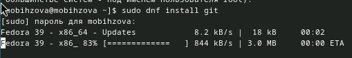{#fig:001 width=70%}

Устанавливаю gh (рис. [-@fig:002]).

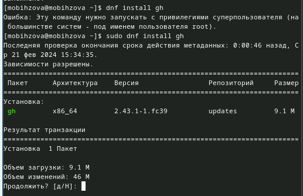{#fig:002 width=70%}

## Базовая настройка git.

Задаю имя и email владельца репозитория (рис. [-@fig:003]).

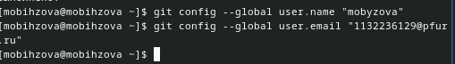{#fig:003 width=70%}

Настраиваю utf-8 в выводе сообщений git (рис. [-@fig:004]).

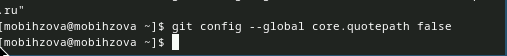{#fig:004 width=70%}

Зададаю имя начальной ветки (будем называть её master) (рис. [-@fig:005]).

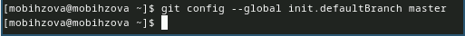{#fig:005 width=70%}

Задаю параметр autocrlf (рис. [-@fig:006]).

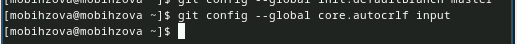{#fig:006 width=70%}

Задаю параметр safecrlf (рис. [-@fig:007]).

{#fig:007 width=70%}

## Создание ключа ssh.

Создаю ключ ssh по алгоритму rsa с ключём размером 4096 бит (рис. [-@fig:008]).

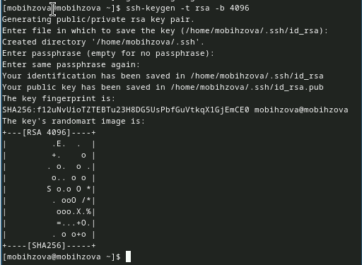{#fig:008 width=70%}

Создаю ключ ssh по алгоритму ed25519 (рис. [-@fig:009]).

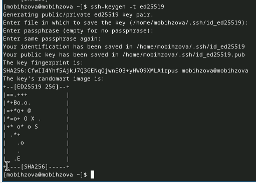{#fig:009 width=70%}

## Создание ключа PGP.

Генерирую ключ PGP, затем выбираю тип ключа RSA and RSA, задаю максимальную длину ключа: 4096, оставляю неограниченный срок действия ключа. Далее отвечаю на вопросы программы о личной информации (рис. [-@fig:010]).

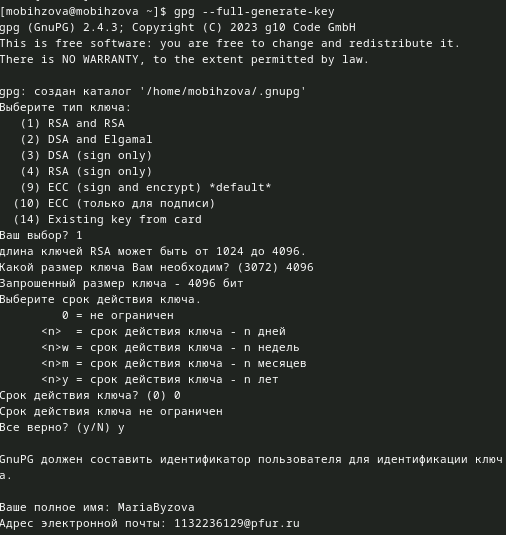{#fig:010 width=70%}

## Настройка github.

У меня уже был создан аккаунт на Github, соответсвенно, основные данные аккаунта я так же заполняла и проводила его настройку, поэтому просто вхожу в свой аккаунт (рис. [-@fig:011]).

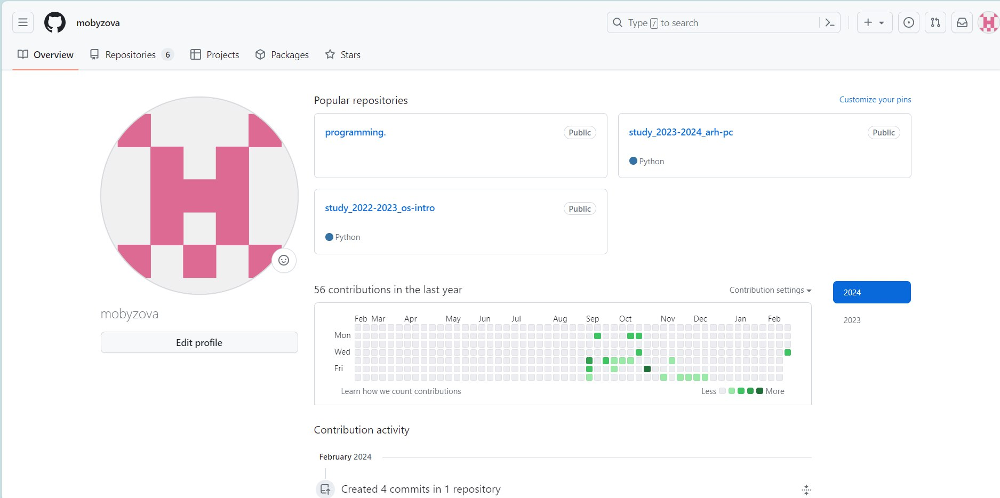{#fig:011 width=70%}

## Добавление ключа PGP в Github

Вывожу список ключей и копирую отпечаток приватного ключ (рис. [-@fig:012]).

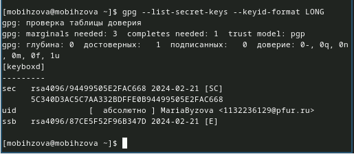{#fig:012 width=70%}

Cкопирую мой сгенерированный PGP ключ в буфер обмена (рис. [-@fig:013]).

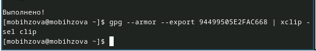{#fig:013 width=70%}

Перейду в настройки GitHub, нажму на кнопку New GPG key и вставлю полученный ключ в поле ввода (рис. [-@fig:014]).

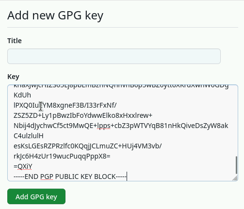{#fig:014 width=70%}

## Настройка автоматических подписей коммитов git.

Используя введёный email, укажу Git применять его при подписи коммитов (рис. [-@fig:015]).

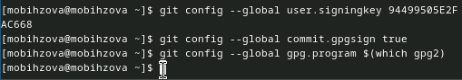{#fig:015 width=70%}

## Настройка gh.

Для начала авторизируюсь: отвечаю на наводящие вопросы от утилиты, в конце выбираю авторизироваться через браузер (рис. [-@fig:016]).

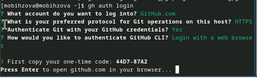{#fig:016 width=70%}

Завершаю авторизацию на сайте (рис. [-@fig:017]).

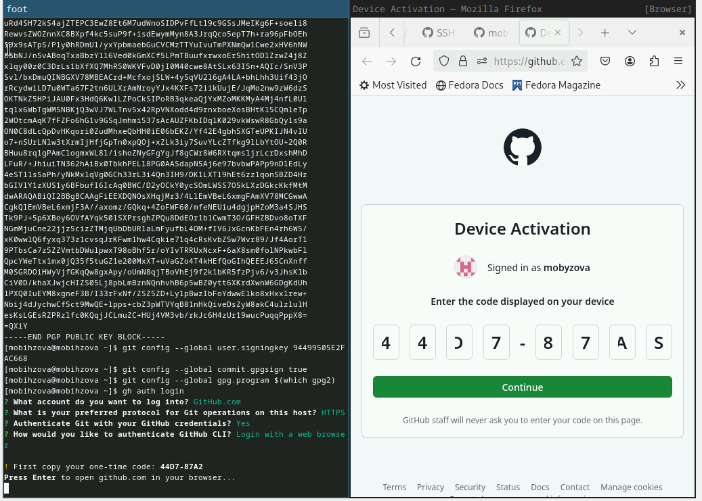{#fig:017 width=70%}

Авторизация прошла успешно (рис. [-@fig:018]).

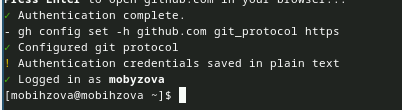{#fig:018 width=70%}

## Создание репозитория курса на основе шаблона.

Сначала создаю директорию с помощью утилиты mkdir и флага -p, который позволяет установить каталоги на всем указанном пути. После этого с помощью утилиты cd перехожу в только что созданную директорию (рис. [-@fig:019]).

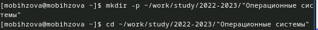{#fig:019 width=70%}

Далее создаю репозиторий на основе шаблона репозитория (рис. [-@fig:020]).

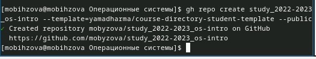{#fig:020 width=70%}

Клонирую репозиторий (рис. [-@fig:021]).

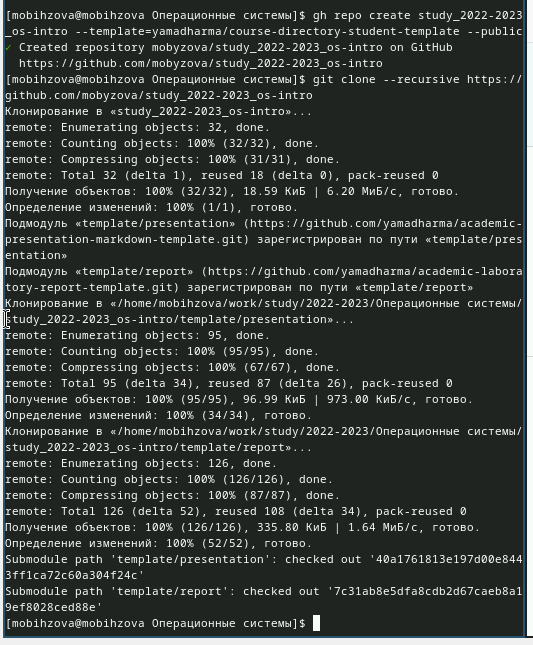{#fig:021 width=70%}

## Настройка каталога курса.

Перехожу в каталог курса (рис. [-@fig:022]).

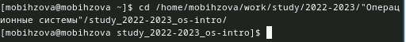{#fig:022 width=70%}

Удаляю лишние файлы (рис. [-@fig:023]).

{#fig:023 width=70%}

Создаю необходимые каталоги (рис. [-@fig:024]).

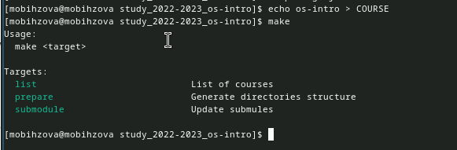{#fig:024 width=70%}

Отправляю файлы на сервер (рис. [-@fig:025]).

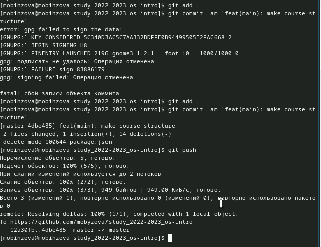{#fig:025 width=70%}

# Выводы

В ходе выполнения данной лабораторной работы я изучила идеологию и применение средств контроля версий, освоила умения по работе с git.

# Ответы на контрольные вопросы.

1. Системы контроля версий (VCS) - программное обеспечение для облегчения работы с изменяющейся информацией. Они позволяют хранить несколько версий изменяющейся информации, 
одного и того же документа, может предоставить доступ к более ранним версиям документа. Используется для работы нескольких человек над проектом, позволяет посмотреть, кто и 
когда внес какое-либо изменение и т. д. VCS ррименяются для: Хранения понлой истории изменений, сохранения причин всех изменений, поиска причин изменений и совершивших изменение, совместной работы над проектами.

2. Хранилище -- репозиторий, хранилище версий, в нем хранятся все документы, включая историю их изменения и прочей служебной информацией. 
commit -- отслеживание изменений, сохраняет разницу в изменениях.История -- хранит все изменения в проекте и позволяет при необходимости вернуться/обратиться к нужным данным.
Рабочая копия -- копия проекта, основанная на версии из хранилища, чаще всего последней версии.

3. Централизованные VCS (например: CVS, TFS, AccuRev) -- одно основное хранилище всего проекта. Каждый пользователь копирует себенеобходимые ему файлы из этого репозитория, изменяет, затем добавляет изменения обратно в хранилище. Децентрализованные
VCS (например: Git, Bazaar) -- у каждого пользователя свой вариант репозитория (возможно несколько вариантов), есть возможность добавлятьи забирать изменения из любого репозитория. В отличие от классических, в распределенных (децентралиованных)
системах контроля версий центральный репозиторий не является обязательным.
4. Сначала создается и подключается удаленный репозиторий, затем по мере изменения проекта эти изменения отправляются на сервер.

5. Участник проекта перед началом работы получает нужную ему версию проекта в хранилище, с помощью определенных команд, после внесения изменений пользователь размещает новую версию в хранилище. При этом предыдущие версии не удаляются. К ним можно вернуться в любой момент.

6. Хранение информации о всех изменениях в вашем коде, обеспечение удобства командной работы над кодом.

7. Создание основного дерева репозитория: git init
Получение обновлений (изменений) текущего дерева из центрального репозитория: git pull
Отправка всех произведённых изменений локального дерева в центральный репозиторий: git push
Просмотр списка изменённых файлов в текущей директории: git status
Просмотр текущих изменений: git diff
Сохранение текущих изменений: добавить все изменённые и/или созданные файлы и/или каталоги: git add .
добавить конкретные изменённые и/или созданные файлы и/или каталоги: git add имена_файлов
удалить файл и/или каталог из индекса репозитория (при этом файл и/или каталог остаётся в локальной директории): git rm имена_файлов
Сохранение добавленных изменений:
сохранить все добавленные изменения и все изменённые файлы: git commit -am 'Описание коммита'
сохранить добавленные изменения с внесением комментария через встроенный редактор: git commit
создание новой ветки, базирующейся на текущей: git checkout -b имя_ветки
переключение на некоторую ветку: git checkout имя_ветки (при переключении на ветку, которой ещё нет в локальном репозитории, она будет создана и связана с удалённой)
отправка изменений конкретной ветки в центральный репозиторий: git push origin имя_ветки
слияние ветки с текущим деревом: git merge --no-ff имя_ветки
Удаление ветки:
удаление локальной уже слитой с основным деревом ветки: git branch -d имя_ветки
принудительное удаление локальной ветки: git branch -D имя_ветки
удаление ветки с центрального репозитория: git push origin :имя_ветки

8. git push -all отправляем из локального репозитория все сохраненные изменения в центральный репозиторий, предварительно создав локальный репозиторий и сделав предварительную конфигурацию.

9. Ветвление - один из параллельных участков в одном хранилище, исходящих из одной версии, обычно есть главная ветка. Между ветками, т. е. их концами возможно их слияние. Используются для разработки новых функций.

10. Во время работы над проектом могут создаваться файлы, которые не следуют добавлять в репозиторий. Например, временные файлы.
Можно прописать шаблоны игнорируемых при добавлении в репозиторий типов файлов в файл .gitignore с помощью сервисов.

# Список литературы{.unnumbered}

::: {#refs}
1. Лабораторная работа №2 [Электронный ресурс] URL: https://esystem.rudn.ru/mod/page/view.php?id=1098933#org2c71102
:::
