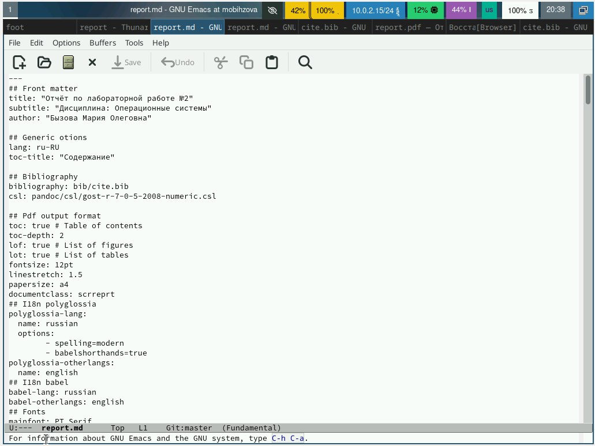

---
## Front matter
lang: ru-RU
title: "Лабораторная работа №3"
subtitle: Операционные системы
author:
  - Бызова Мария Олеговна, НПИбд-01-23.
institute:
  - Российский университет дружбы народов, Москва, Россия
date: 21 февраля 2024.

## i18n babel
babel-lang: russian
babel-otherlangs: english

## Formatting pdf
toc: false
toc-title: Содержание
slide_level: 2
aspectratio: 169
section-titles: true
theme: metropolis
header-includes:
 - \metroset{progressbar=frametitle,sectionpage=progressbar,numbering=fraction}
 - '\makeatletter'
 - '\beamer@ignorenonframefalse'
 - '\makeatother'

## Fonts 
mainfont: PT Serif 
romanfont: PT Serif 
sansfont: PT Sans 
monofont: PT Mono 
mainfontoptions: Ligatures=TeX 
romanfontoptions: Ligatures=TeX 
sansfontoptions: Ligatures=TeX,Scale=MatchLowercase 
monofontoptions: Scale=MatchLowercase,Scale=0.9

---

## Цель работы

Целью данной лабораторной работы является научиться оформлять отчёты с помощью легковесного языка разметки Markdown.

## Задание

1. Сделайте отчёт по предыдущей лабораторной работе в формате Markdown.
2. В качестве отчёта предоставляются отчёты в 3 форматах: pdf, docx и md (в архиве, поскольку он должен содержать скриншоты, Makefile и т.д.)

## Теоретическое введение

Markdown — облегчённый язык разметки, созданный с целью обозначения форматирования в простом тексте, с максимальным сохранением его читаемости человеком, и пригодный для машинного преобразования в языки для продвинутых публикаций.

## Выполнение лабораторной работы

Перехожу в каталог, в котором находится шаблон для отчёта по лабораторной работе с помощью утилиты cd (рис. 1).

{#fig:001 width=70%}

## Выполнение лабораторной работы

Открываю файл report.md с помощью текствого редактора Emacs (рис. 2).

{#fig:002 width=70%}

## Выполнение лабораторной работы

Приступаю к заполнению отчета по лабораторной работе №2, подробно описывая все выполненные в ходе работы действия (рис. 3).

{#fig:003 width=70%}

## Выполнение лабораторной работы

В файле cite.bib c помощью текстового редактора Emacs изменяю список библиографии, вставив интернет-ресурс, который я использовала (рис. 4).

{#fig:004 width=70%}

## Выполнение лабораторной работы

После изменения шаблона в соответствии с языком разметки Markdown, я выполняю компиляцию из формата md в формы docx и pdf (рис. 5).

{#fig:005 width=70%}

## Выполнение лабораторной работы

При помощи утилиты ls убедимся в корректности компиляции отчёта. Все необходимые файлы созданы успешно (рис. 6).

{#fig:006 width=70%}

## Выводы

В ходе выполнения данной лабораторной работы я научилась оформлять отчёты с помощью легковесного языка разметки Markdown.

## Список литературы{.unnumbered}

::: {#refs}
1. Лабораторная работа №3 [Электронный ресурс] URL: https://esystem.rudn.ru/mod/resource/view.php?id=1098935
:::

