---
## Front matter
lang: ru-RU
title: "Лабораторная работа №4"
subtitle: Операционные системы
author:
  - Бызова Мария Олеговна, НПИбд-01-23.
institute:
  - Российский университет дружбы народов, Москва, Россия
date: 04 марта 2024

## i18n babel
babel-lang: russian
babel-otherlangs: english

## Formatting pdf
toc: false
toc-title: Содержание
slide_level: 2
aspectratio: 169
section-titles: true
theme: metropolis
header-includes:
 - \metroset{progressbar=frametitle,sectionpage=progressbar,numbering=fraction}
 - '\makeatletter'
 - '\beamer@ignorenonframefalse'
 - '\makeatother'

## Fonts 
mainfont: PT Serif 
romanfont: PT Serif 
sansfont: PT Sans 
monofont: PT Mono 
mainfontoptions: Ligatures=TeX 
romanfontoptions: Ligatures=TeX 
sansfontoptions: Ligatures=TeX,Scale=MatchLowercase 
monofontoptions: Scale=MatchLowercase,Scale=0.9

---

## Цель работы

Целью данной лабораторной работы является получение навыков правильной работы с репозиториями git.

## Задание

1. Выполнить работу для тестового репозитория.
2. Преобразовать рабочий репозиторий в репозиторий с git-flow и conventional commits.

## Установка git-flow.

Установим git-flow из коллекции репозиториев Copr (https://copr.fedorainfracloud.org/coprs/elegos/gitflow/) (рис. 1 и 2).

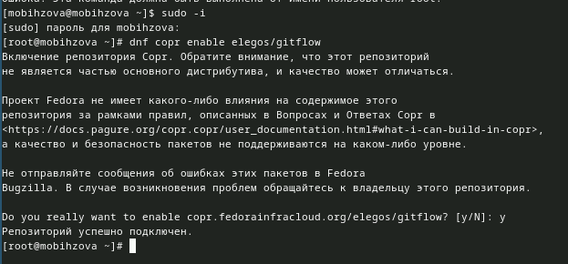{#fig:001 width=70%}

## Установка git-flow.

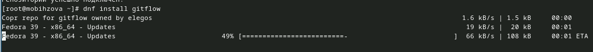{#fig:002 width=70%}

## Установка Node.js.

На Node.js базируется программное обеспечение для семантического версионирования и общепринятых коммитов. Установим его (рис. 3 и 4).

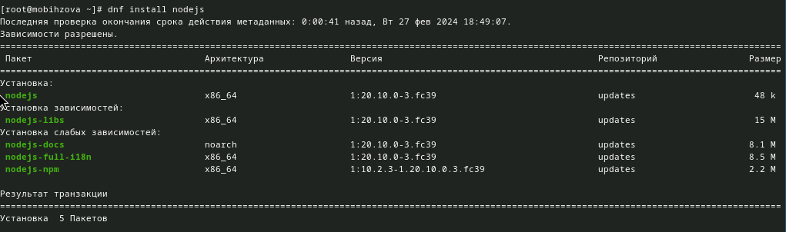{#fig:003 width=70%}

## Установка Node.js.

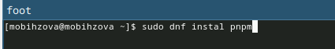{#fig:004 width=70%}

## Настройка Node.js

Теперь запустим (рис. 5)

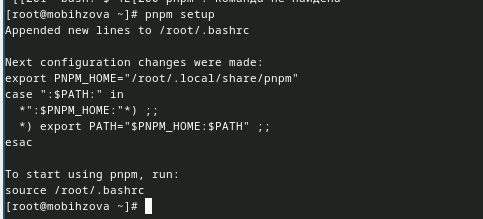{#fig:005 width=70%}

## Настройка Node.js

Выполним следующую команду (рис. 6)

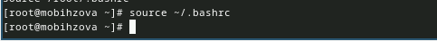{#fig:006 width=70%}

## Общепринятые коммиты.

Введём команду pnpm add -g commitizen. Данная программа используется для помощи в форматировании коммитов. При этом устанавливается скрипт git-cz, который мы и будем использовать для коммитов (рис. 7)

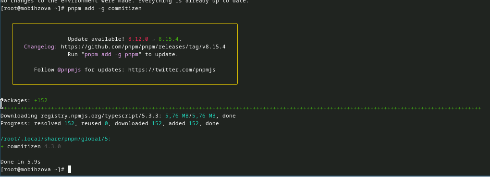{#fig:007 width=70%}

## Общепринятые коммиты.

Введём команду pnpm add -g standard-changelog. Данная программа используется для помощи в создании логов. (рис. 8])

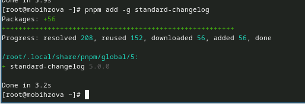{#fig:008 width=70%}

## Общепринятые коммиты.

Теперь создадим репозиторий git и подключим репозиторий к github. Предварительно создаём репозиторий на GitHub и клонируем его к себе (рис. 9)

{#fig:009 width=70%}

## Общепринятые коммиты.

Сделаем первый коммит и выложим на GitHub (рис. 10)

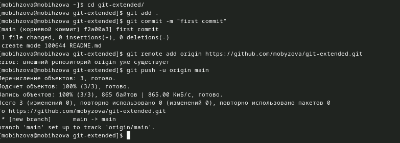{#fig:010 width=70%}

## Общепринятые коммиты.

ВЫполним конфигурацию для пакетов Node.js (рис. 11)

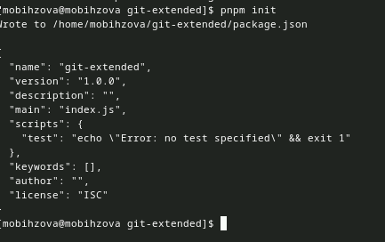{#fig:011 width=70%}

## Общепринятые коммиты.

Теперь необходимо заполнить несколько параметров пакета (рис. 12)

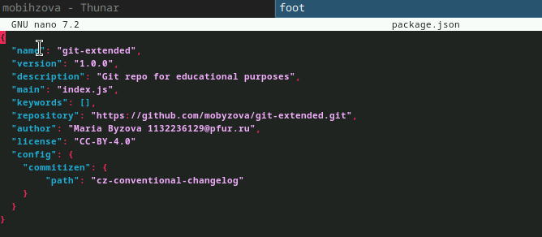{#fig:012 width=70%}

## Общепринятые коммиты.

Добавим новые файлы и выполним коммит (рис. 13)

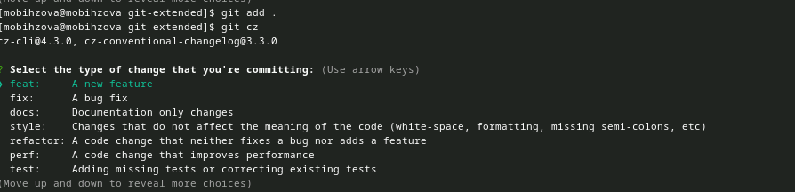{#fig:013 width=70%}

## Общепринятые коммиты.

Отправим на github (рис. 14)

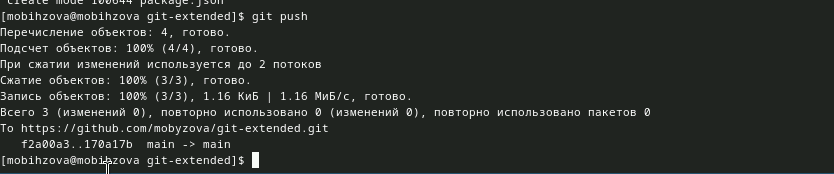{#fig:014 width=70%}

## Общепринятые коммиты.

Инициализируем git-flow и префикс для ярлыков установим в v (рис. 15)

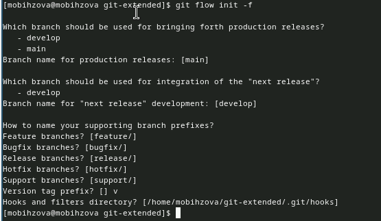{#fig:015 width=70%}

## Общепринятые коммиты.

Проверим, что мы на ветке develop (рис. 16)

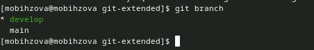{#fig:016 width=70%}

## Общепринятые коммиты.

Загрузим весь репозиторий в хранилище (рис. 17)

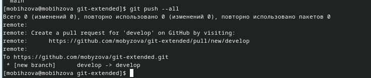{#fig:017 width=70%}

## Общепринятые коммиты.

Установим внешнюю ветку как вышестоящую для этой ветки (рис.18)

{#fig:018 width=70%}

## Общепринятые коммиты.

Создадим релиз с версией 1.0.0 (рис. 19)

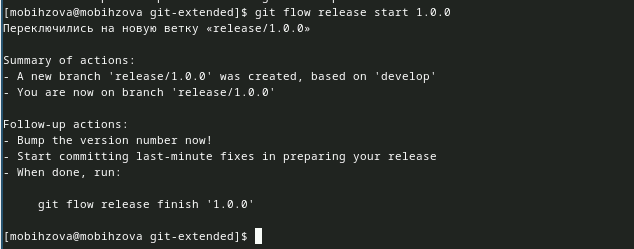{#fig:019 width=70%}

## Общепринятые коммиты.

Создадим журнал изменений (рис. 20)

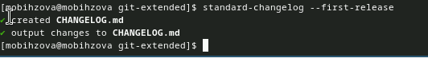{#fig:020 width=70%}

## Общепринятые коммиты.

Добавим журнал изменений в индекс (рис. 21)

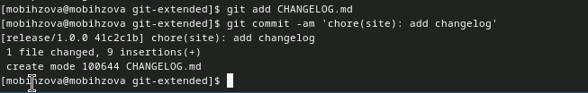{#fig:021 width=70%}

## Общепринятые коммиты.

Зальём релизную ветку в основную ветку (рис. 22)

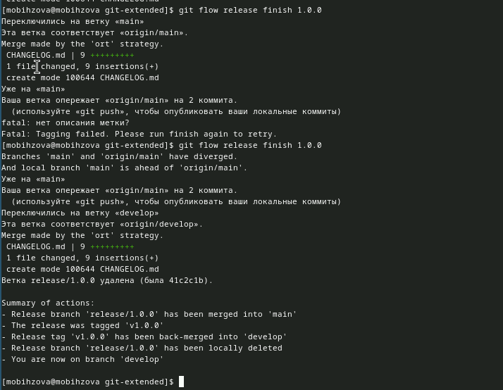{#fig:022 width=70%}

## Общепринятые коммиты.

Отправим данные на github (рис. 23)

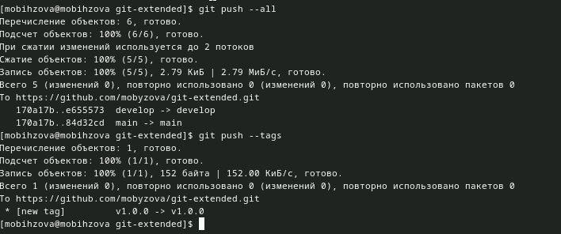{#fig:023 width=70%}

## Общепринятые коммиты.

Создадим релиз на github. Для этого будем использовать утилиты работы с github (рис. 24)

{#fig:024 width=70%}

## Общепринятые коммиты.

Создадим ветку для новой функциональности (рис. 25)

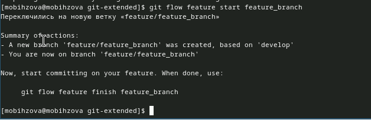{#fig:025 width=70%}

## Общепринятые коммиты.

По окончании разработки новой функциональности следующим шагом следует объединить ветку feature_branch c develop (рис. 26)

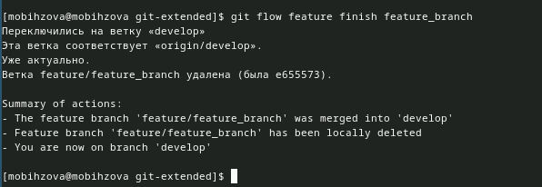{#fig:026 width=70%}

## Общепринятые коммиты.

Создадим релиз с версией 1.2.3 (рис. 27)

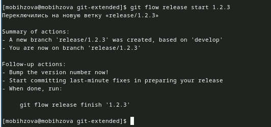{#fig:027 width=70%}

## Общепринятые коммиты.

Обновим номер версии в файле package.json (рис. 28)

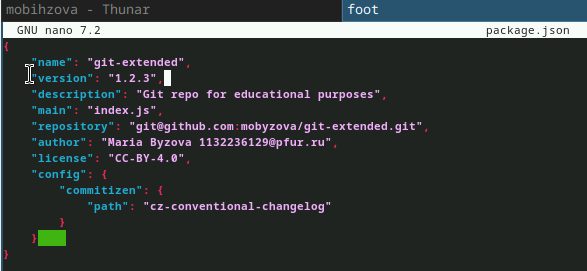{#fig:028 width=70%}

## Общепринятые коммиты.

Создадим журнал изменений (рис. 29)

{#fig:029 width=70%}

## Общепринятые коммиты.

Добавим журнал изменений в индекс (рис. 30)

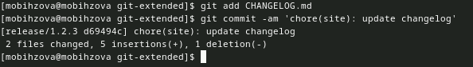{#fig:030 width=70%}

## Общепринятые коммиты.

Зальём релизную ветку в основную ветку (рис. 31)

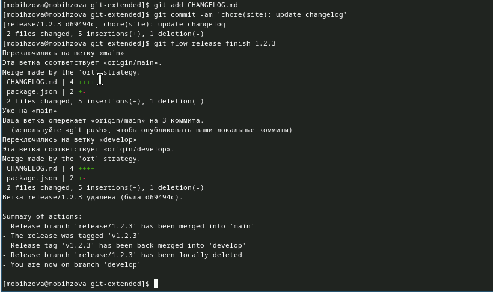{#fig:031 width=70%}

## Общепринятые коммиты.

Отправим данные на github (рис. 32)

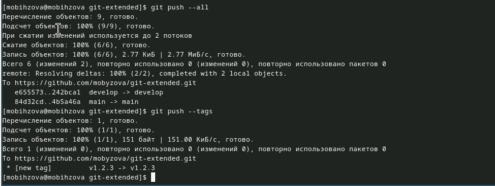{#fig:032 width=70%}

## Общепринятые коммиты.

Создадим релиз на github с комментарием из журнала изменений (рис. 33)

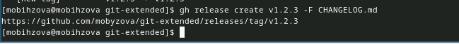{#fig:033 width=70%}

## Выводы

В ходе выполнения данной лабораторной работы я получила навыки правильной работы с репозиториями git.

## Список литературы{.unnumbered}

::: {#refs}
1. Лабораторная работа №4 [Электронный ресурс] URL: https://esystem.rudn.ru/mod/page/view.php?id=1098937#org5411099
:::
